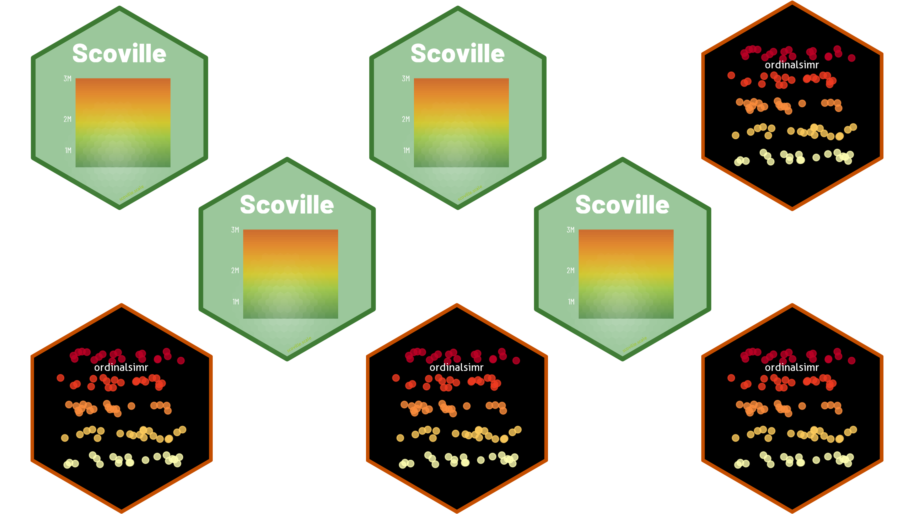
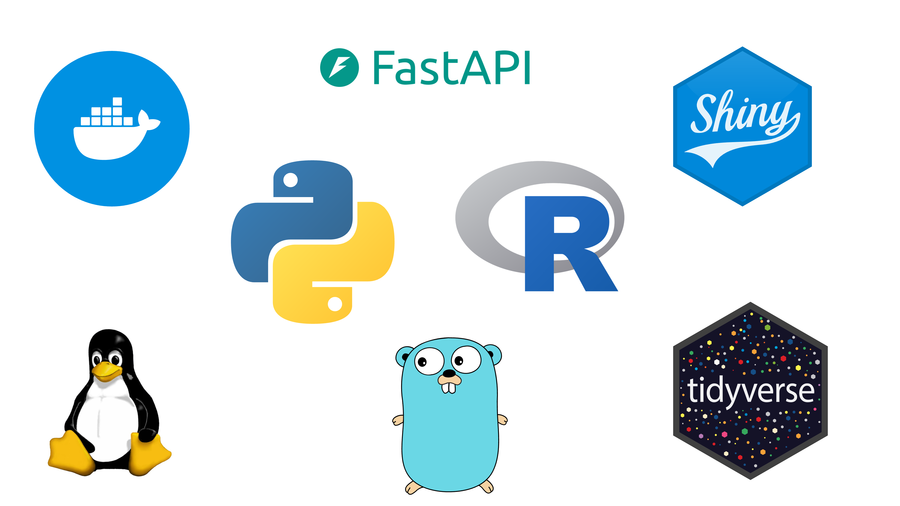

# Hi, I’m Pat

I’m a data scientist and statistical programmer who builds tools for understanding the world through data. I work in R, write about statistics and simulations, and occasionally build R packages.

## [Posts](posts.llms.md)

### Analyses

### Code

### Hobbies

## [Projects and Software](projects.llms.md)

Projects built on (or building) Python, FastAPI, SQL, R Packages, Shiny, Docker, and sometimes Go.

## [About Me](about.llms.md)

A bit more about my background, skills, and work of yours I might be able to contribute to!
