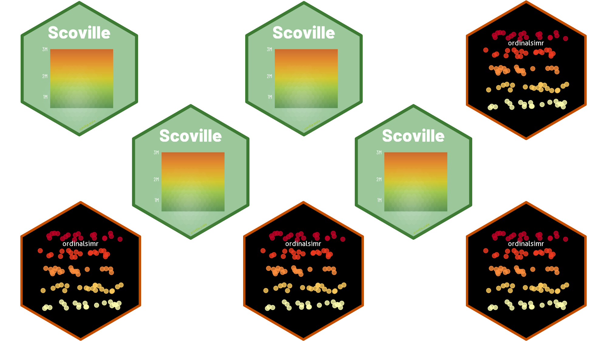
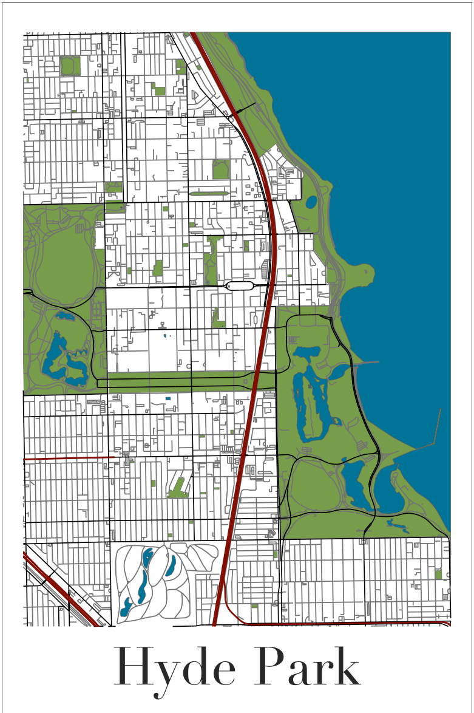
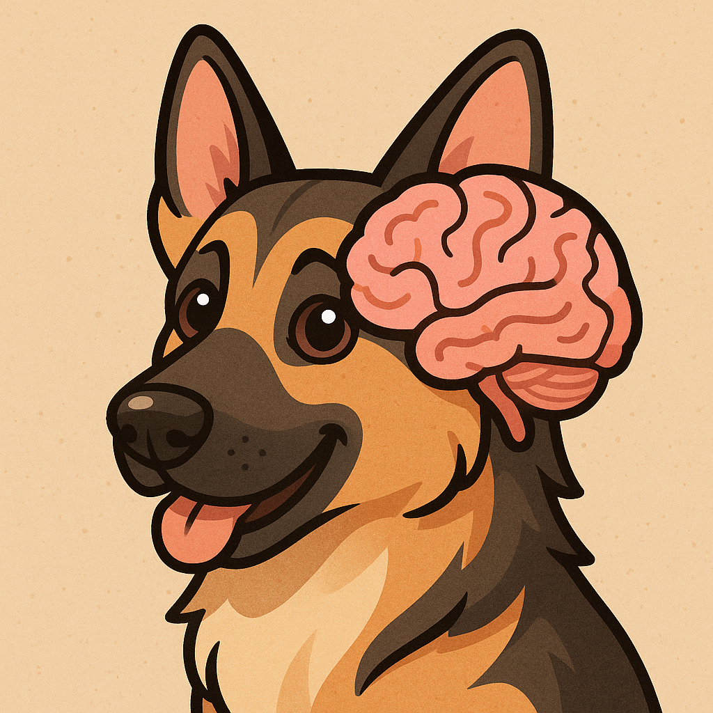

I'm a data scientist and statistical programmer who builds tools for understanding the world through data. I work in R, write about statistics and simulations, and occasionally build R packages.

::: {style="display: flex; gap: 1.5rem; margin-top: 1.5rem;"}
[About Me](about.qmd){.btn .btn-outline-secondary} [See my projects](projects.qmd){.btn .btn-outline-secondary} [Read the blog](posts.qmd){.btn .btn-outline-secondary}
:::

:::{.column-screen .brand-banner-color}
:::{.column-page}

::: {.row}
::: {.col-md-6}
::: {.banner-image-container}
{.banner-image}
:::
:::

::: {.col-md-6 .d-flex .flex-column}

## [Posts](posts.qmd) 

::: {.row .my-auto}
::: {.col-sm-4}

::: {.icon-block}

<i class="fa-solid fa-chart-column"></i>

###  Analyses
:::

:::
::: {.col-sm-4}

::: {.icon-block}
  <i class="fa-solid fa-code"></i>
  
###  Programming

:::

:::
::: {.col-sm-4}

::: {.icon-block}
  <i class="fa-solid fa-person-running"></i>
  
###  Hobbies

:::

:::
:::

:::
:::

:::
:::

<!-- switch to software/projects here -->

:::{.column-screen .brand-banner}
:::{.column-page}

::: {.row}
::: {.col-md-6}

## [Projects and Software](projects.qmd)

Some info about projects and software here or three most recent
:::

::: {.col-md-6}
::: {.banner-image-container}
{.banner-image}
:::
:::
:::

:::
:::

<!-- final banner here with some color -->

:::{.column-screen .brand-banner-color}
:::{.column-page}

::: {.row}
::: {.col-md-6}
::: {.banner-image-container}
{.banner-image}
:::
:::

::: {.col-md-6}

#### Something here for parallel structure

Some info about posts here or three most recent
:::
:::

:::
:::
