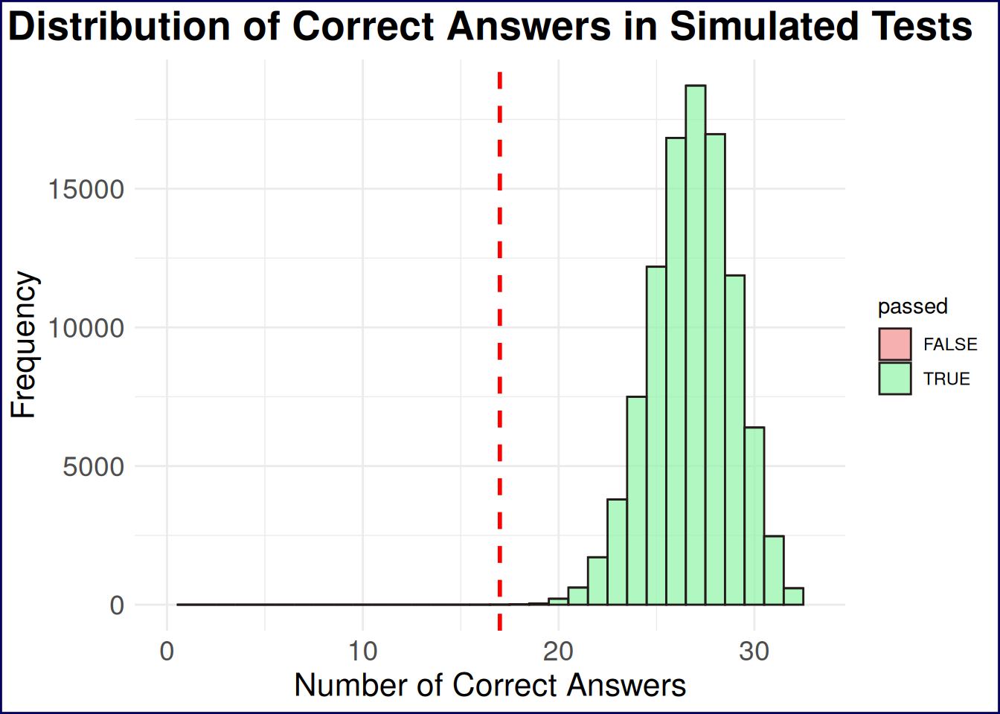
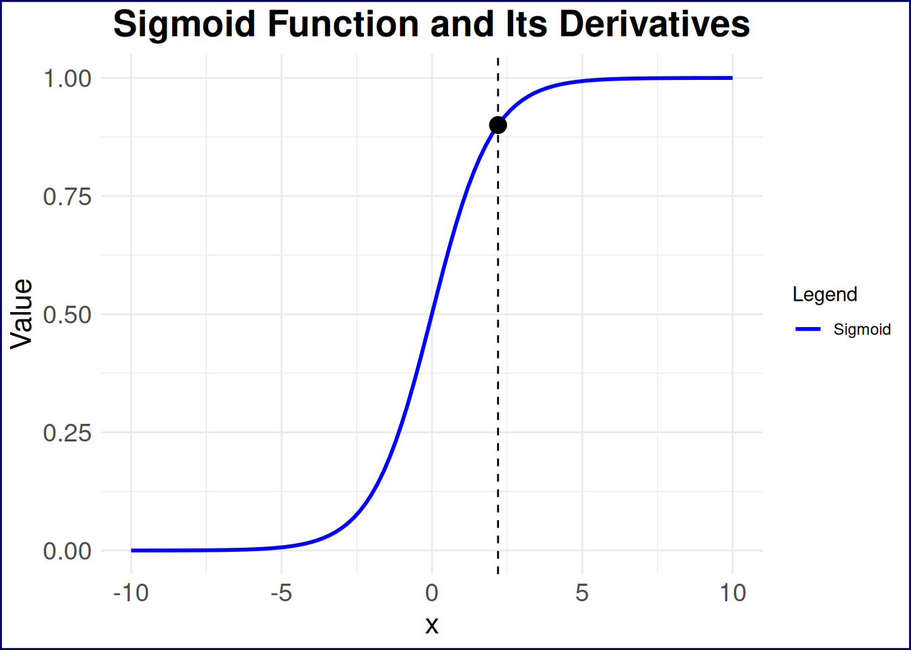
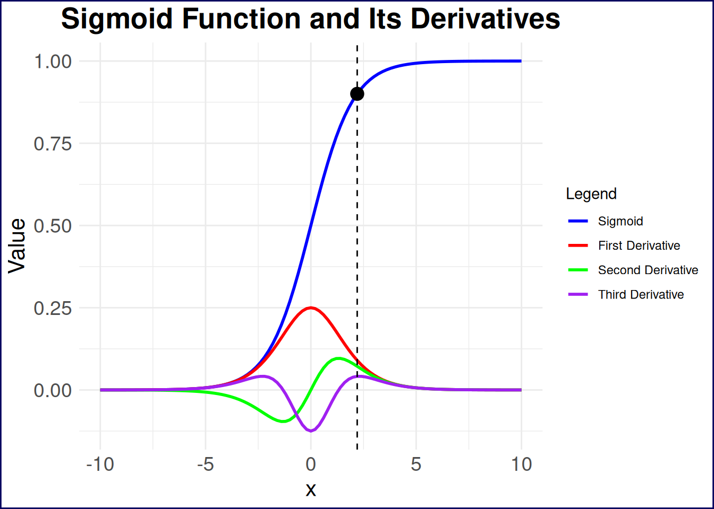
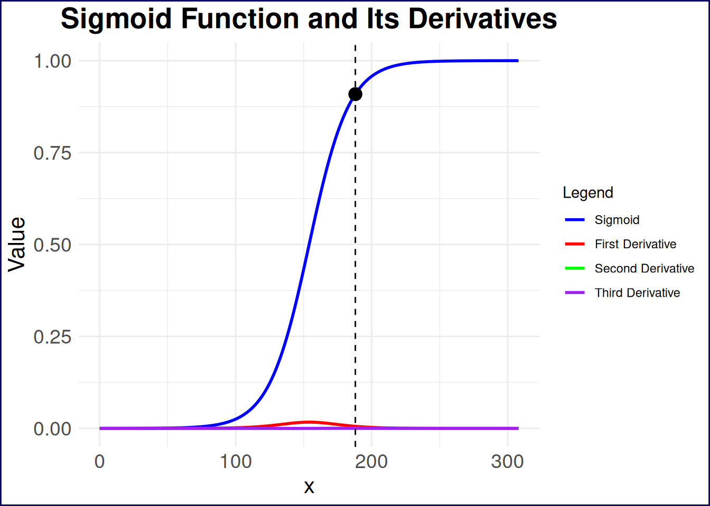
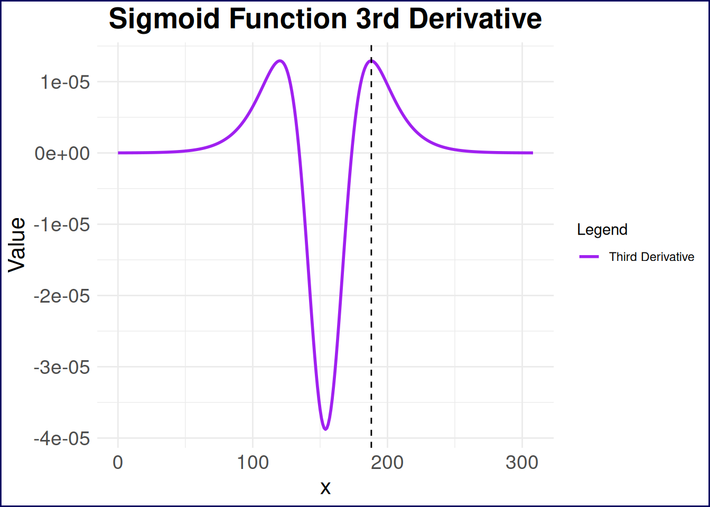

# Monte Carlo Simulation of Passing a Test

Monte Carlo

Simulation

R

Haven’t I studied enough already?

Author

Pat

Published

August 6, 2025

Modified

July 7, 2026

Load R Libraries

``` r
library(purrr)
library(tidyr)
library(ggplot2)
library(dplyr)

theme_set(theme_minimal())
theme_update(
  plot.background = element_rect(
    color = "#06005eff",
    linewidth = 1
  )
)
```

## Context

I recently had to take a multiple choice test, and I was, frankly, tired of studying for it. The test wasn’t particularly difficult, but it did require quite a bit of rote memorization of dates, historical events, and other facts. Fortunately, this test’s parameters are very well defined: there’s a bank of ~300 possible, publicly-available questions, the test is generated by randomly selecting 33 of those questions, and to pass the test, you only need to get over 50% of the questions correct, which means you can answer *just* 17 questions correctly to pass.

As I was in the middle of my vacation and studying for this test, I kept asking myself “Haven’t I studied enough already?” And so I decided to get an answer to that question with simulations, specifically a Monte Carlo simulation. More precisely, I wanted to find out what percentage of the time I would pass the actual test based on my current level of knowledge, as represented by the total number of practice question I had answered correctly.

## Monte Carlo Simulations

First things first: what is a Monte Carlo simulation? In short, it’s a statistical technique that uses random sampling to obtain numerical results. The idea is to run many simulations (or “trials”) and analyze the results to understand the behavior of the system. In this case, I wanted to simulate the process of taking the test multiple times, each time randomly selecting answers based on my current knowledge level. The key steps in a Monte Carlo simulation are:

1.  **Define the Problem**: In this case, the problem is to determine the probability of passing the test based on my current knowledge level.
2.  **Model the System**: Create a model that represents the system being studied. Here, the model is the test-taking process, where I randomly select answers based on my knowledge level.
3.  **Run Simulations**: Execute the model multiple times, each time with different random inputs to simulate the variability in the system.
4.  **Analyze Results**: Collect and analyze the results to draw conclusions about the system’s behavior.

With a very basic understanding of Monte Carlo simulation in hand, let’s take a look at the precise parameters I used for my simulation and the code to run it.

## Simulation Parameters and Code

I was working with a total of 308 possible questions, and I had answered 250 of those correctly (mostly through actual knowledge, but a handful through educated guessing or simple chance). The test again consists of 33 randomly selected questions, and I needed to answer at least 17 of those correctly to pass. With those parameters in mind, my chances of passing the test already seem intuitively good as I had answered 81.17% of the questions correctly. But I wanted to see how that translated into actual test-taking scenarios, so I wrote the following R code to run the simulation:

Show Me the Code!

``` r
# Set parameters
total_questions <- 308
correct_answers <- 250
test_questions <- 33
passing_score <- 17
n_simulations <- 100000


# create a vector to represent practice results
practice_results <- c(
  rep(1, correct_answers),
  rep(0, total_questions - correct_answers)
)

# sample 33 (i.e. test_questions) of those questions without replacement, and replicate this 10000 times
simulation_results <- replicate(n_simulations, {
  sum(sample(practice_results, test_questions, replace = FALSE))
})
```

Listing 1: Simple Monte Carlo simulation for passing the test

So what exactly is happening in [Listing 1](#lst-monte-carlo-simulation)? First, I set the parameters for the simulation, including the total number of questions, the number of questions I had answered correctly, the number of questions on the test, the passing score, and the number of simulations to run.

Next, I created a vector called `practice_results` that represents my practice results, where `1` indicates a correct answer and `0` indicates an incorrect answer. This vector is constructed by repeating `1` for the number of correct answers and `0` for the remaining questions.

Finally, I used the `replicate()` function to run the simulation `n_simulations` times. In each iteration, I randomly sampled 33 questions from the `practice_results` vector without replacement and summed the number of correct answers. The result is stored in the `simulation_results` vector.

In short then, I have a vector of 10,000 test results, each representing the number of questions I answered correctly on a simulated test. Now, I can analyze these results to determine the probability of passing the test.

## Analyzing the Results

A simple first step is to plot the distribution of the number of correct answers across all simulations. This will give us a visual representation of how many times I passed the test.

Show Me the Code!

``` r
data.frame(correct_answers = simulation_results) %>%
  mutate(passed = correct_answers >= 17) %>%
  ggplot(aes(x = correct_answers, fill = passed)) +
  geom_histogram(binwidth = 1, color = "#241a1aff", alpha = 0.7) +
  labs(
    title = "Distribution of Correct Answers in Simulated Tests",
    x = "Number of Correct Answers",
    y = "Frequency"
  ) +
  geom_vline(xintercept = 17, linetype = "dashed", color = "red", size = 1) +
  theme(
    plot.title = element_text(hjust = 0.5, size = 20, face = "bold"),
    axis.text = element_text(size = 14),
    axis.title = element_text(size = 16)
  ) +
  scale_x_continuous(limits = c(0, 33)) +
  scale_fill_manual(values = c("TRUE" = "#8ef4a7ff", "FALSE" = "#f48e8eff"))
```



Figure 1: Distribution of Correct Answers in Simulated Tests

From the histogram alone, we can see that nearly all of the simulated tests resulted in a passing score, with the vast majority of results clustering around 25 correct answers. Any reasonable interpretation of this histogram would suggest that I should be able to pass the test with a high degree of confidence. But let’s quantify it further by calculating the percentage of simulations that resulted in a passing score.

Show Me the Code!

``` r
passing_rate <- mean(simulation_results >= passing_score) * 100
```

This yields a passing rate of 99.999%…I think I can stop studying now!

## I Could Have Studied Less

But when *could* I have stopped studying? To answer this, we’ll need to re-run the simulation with different numbers of correct answers on the practice test. Specifically, we’ll run the simulation for every possible number of correct answers from 0 to 308 and calculate the passing rate for each case.

First, let’s set up the simulation for all possible practice test scores:

Show Me the Code!

``` r
# Create empty matrix to hold results
results_mat <- matrix(0, 308, 308)
# Fill lower triangle with 1s to represent valid practice test scores
results_mat[lower.tri(results_mat)] <- 1
# Transpose the matrix to have practice test scores as rows and simulation results as columns
results_mat <- t(results_mat)
# add last column for case of all correct on practice test
results_mat <- cbind(results_mat, 1)


# Run simulations for all practice test scores
simulation_all_levels <- results_mat %>%
  as.data.frame() %>%
  tibble::tibble() %>%
  purrr::map(
    ~ replicate(
      10000,
      sum(sample(.x, 33, replace = FALSE))
    )
  )
```

Listing 2: Monte Carlo simulation for all practice test scores

[Listing 2](#lst-monte-carlo-simulation-all-levels) can be thought of in a few different steps, First, I create an empty matrix with 308 rows and 308 columns, where each row represents a different number of correct answers on the practice test (from 0 to 307–not to 308, but we’ll clarify this in a moment)). The lower triangle of the matrix is then filled with `1`s which means that each row represents a test score with one more correct answer than the previous row. However, I don’t like to have the rows representing the practice tests, and find it preferable to have the practice test scores as columns, so I transpose the matrix with `t()`. Finally, I add a last column to represent the case where all questions on the practice test were answered correctly (i.e., 308 correct answers).

With the data matrix now set up, we can essentially recreate the simulations we ran in [Listing 1](#lst-monte-carlo-simulation), but this time for every possible number of correct answers on the practice test. This means mapping over each column of the data, and running the simulation for each practice test score. The result is a list of vectors, where each vector contains the results of 10,000 simulated tests for a specific number of correct answers on the practice test.

So, what can we do with these results? We can calculate the probability of passing the test for each number of correct answers on the practice test, and then plot the results to see how the probability of passing changes as the number of correct answers increases.

Show Me the Code!

``` r
# Ggplot only

# simulation_all_levels %>%
#   map_dbl(
#     ~sum(.x >= 17)/10000
#   ) %>%
#   tibble::tibble(passig_probability = .) %>%
#   mutate(number_correct_practice = row_number()) %>%
#   ggplot(aes(number_correct_practice, passig_probability)) +
#   geom_point() +
#   geom_line() +
#   theme(
#     plot.title = element_text(hjust = 0.5, size = 20, face = "bold"),
#     axis.text = element_text(size = 14),
#     axis.title = element_text(size = 16)
#   ) +
#   labs(
#     title = "Probability of Passing Test Based on Practice Test Scores",
#     x = "Number of Correct Answers on Practice Test",
#     y = "Probability of Passing"
#   )

## Plotly solution

results_with_ci <- simulation_all_levels %>%
  set_names(0:(length(simulation_all_levels) - 1)) %>% # Name the list elements
  map_dfr(
    ~ {
      successes <- sum(.x >= 17)
      trials <- length(.x)
      proportion <- successes / trials
      ci <- binom.test(successes, trials)$conf.int
      tibble(
        passing_probability = proportion,
        lower_ci = ci[1],
        upper_ci = ci[2]
      )
    },
    .id = "number_correct_practice"
  ) %>%
  mutate(number_correct_practice = as.numeric(number_correct_practice))


ribbon_plot <- results_with_ci %>%
  mutate(upper_ci = round(upper_ci, 4), lower_ci = round(lower_ci, 4)) %>%
  rename(
    "No. Correct Practice" = number_correct_practice,
    "Passing Probability" = passing_probability,
    "Lower 95% CI" = lower_ci,
    "Upper 95% CI" = upper_ci
  ) %>%
  ggplot(aes(x = `No. Correct Practice`, y = `Passing Probability`)) +
  geom_ribbon(
    aes(ymin = `Lower 95% CI`, ymax = `Upper 95% CI`),
    alpha = 0.4,
    fill = "blue"
  ) +
  theme(
    plot.title = element_text(hjust = 0.5, size = 20, face = "bold"),
    axis.text = element_text(size = 14),
    axis.title = element_text(size = 16)
  ) +
  labs(
    title = "Probability of Passing Test",
    subtitle = "Across All Possible Practice Test Scores",
    x = "Number of Correct Answers on Practice Test",
    y = "Probability of Passing"
  )


plotly::ggplotly(ribbon_plot)
```

Figure 2: Probability of Passing the Test Based on Practice Test Scores

Note that I’ve also taken the liberty of adding confidence intervals to the plot, which can be done by calculating the proportion of passing scores and the confidence intervals for each practice test score. This can be done using the `binom.test()` function in R, which provides a confidence interval for the proportion of successes in a binomial distribution. Moreover, the plot.

The overall form of [Figure 2](#fig-passing-probability) is not particularly surprising: the more questions you answer correctly on the practice test, the higher your probability of passing the actual test, and correctly answering half of the questions on the practice yields a 95% confidence interval of \\\[48.95, 50.91\]\\\\ probability of passing the examine. There seems to be an inflection point of diminishing marginal returns around 175 correct answers on the practice test, where the probability of passing the actual test increases at a slower rate as the number of correct answers increases. This is likely due to the fact that once you have a solid understanding of the material, additional practice may not significantly improve your chances of passing.

## Finding the “Optimal” Practice Test Score

Just for fun, let’s model this mathematically and try to find the point at which we experience diminishing returns in studying more practice questions. Based on the form of the plot, the function that describes the probability of passing the test based on the number of correct answers on the practice test is a sigmoid function, which can generally be expressed as:

\\ P(x) = \frac{1}{1 + e^{-x}} \tag{1}\\

However, this function is the most simple version of the sigmoid i.e. it has no parameters adjusting the steepness or midpoint of the curve. The general form of the sigmoid function is:

\\ P(x) = \frac{L}{1 + e^{-k(x - x_0)}} \tag{2}\\

where: - \\P(x)\\ is the probability of passing the test given \\x\\ correct answers on the practice test, - \\L\\ is the maximum value of the function (in this case, the maximum probability of passing the test), - \\k\\ is the steepness of the curve, - \\x_0\\ is the value of \\x\\ at which the function reaches its midpoint (i.e., the point of maximum growth which *should be* at 154 correct practice answers).

### Fitting the Sigmoid Model

With this, let’s first fit a sigmoid model to our data in R so we have actual parameters to work with. The results of this model will give us the parameters \\L\\, \\k\\, and \\x_0\\ that we can use to analyze the inflection point of the sigmoid function. The output of the `nls()` function will provide estimates for these parameters, which we can then use to find the inflection point.

Show Me the Code!

``` r
### NLS exact code
# L_fixed <- 1          # Set your desired value for L
# x0_fixed <- 154         # Set your desired value for x0

# # Custom sigmoid model function with L and x0 fixed
# sigmoid_fixed <- function(k, number_correct_practice) {
#   L_fixed / (1 + exp(-k * (number_correct_practice - x0_fixed)))
# }

# # Fit the model
# sigmoid_model_fixed <- nls(
#   passing_probability ~ sigmoid_fixed(k, number_correct_practice),
#   data = results_with_ci,
#   start = list(k = 0.1),
#   control = nls.control(maxiter = 200),
#   algorithm = "port",
#   lower = c(k = 0),
#   upper = c(k = 10)
# )

sigmoid_model <- nls(
  passing_probability ~ L / (1 + exp(-k * (number_correct_practice - x0))),
  data = results_with_ci,
  start = list(
    L = max(results_with_ci$passing_probability, na.rm = TRUE),
    k = 0.1,
    x0 = median(results_with_ci$number_correct_practice)
  ),
  control = nls.control(maxiter = 200),
  algorithm = "port",
  lower = c(L = 0, k = 0, x0 = min(results_with_ci$number_correct_practice)),
  upper = c(
    L = 1.5 * max(results_with_ci$passing_probability, na.rm = TRUE),
    k = 10,
    x0 = max(results_with_ci$number_correct_practice)
  )
)

sigmoid_model
```

Listing 3: Fitting a Sigmoid Model to the Data

    Nonlinear regression model
      model: passing_probability ~ L/(1 + exp(-k * (number_correct_practice -     x0)))
       data: results_with_ci
            L         k        x0 
      1.00349   0.06796 154.16383 
     residual sum-of-squares: 0.01105

    Algorithm "port", convergence message: both X-convergence and relative convergence (5)

The sigmoid model has an \\L\\ value of 1.0035, a \\k\\ value of 0.068, and an \\x_0\\ value of 154.1638.

\\L\\ technically should not be greater than 1, but in this case it is ever so slightly above 1 simply as a result of the fitting process. I’m going to offend mathematicians (and probably statisticians) here and simply make this 1. Meanwhile, \\x_0\\ came out to essentially be the value of 154 that it should be, and I will likewise round this down to 154 for the modeling. The key parameter we gain from modeling is \\k\\, which is the steepness of the curve. A larger \\k\\ value indicates a steeper curve, meaning that the probability of passing the test increases more rapidly as the number of correct answers on the practice test increases. A smaller \\k\\ value indicates a flatter curve, meaning that the probability of passing the test increases more slowly as the number of correct answers on the practice test increases.

Now that we have the parameters of the sigmoid function, we can develop our mathematical model of the probability of passing the test based on the number of correct answers on the practice test:

\\ P(x) = \frac{1}{1 + e^{-0.0677(x -154)}} \tag{3}\\

With this model, we can now move on to finding the

### Finding the “Inflection Point”

Traditionally, when talking about the inflection point of a function, we are referring to the point at which the curve changes concavity. In the case of a sigmoid function, this is the point at which the function transitions from being concave up to concave down, or vice versa. Put in the context of our test-taking scenario, this is the midpoint of the sigmoid function, where the rate of increase in the probability of passing the test is at its maximum. This point can be found at the value of \\x\\ where the second derivative of the sigmoid function is equal to zero. However, this is not the “inflection point” I’m interested in here for two main reasons.

First, this traditional inflection point will be right at 154/308 correct practice questions, which, in any practical scenario, is simply not a sufficient point at which one should stop studying. In other words, we would expect someone to continue learning the answers to practice questions beyond this point of diminishing marginal returns. Second, my goal is to strike an appropriate balance between the probability of passing the test and the number of questions one needs to learn. So where do I think this is? Let’s take a look at [Figure 3](#fig-sigmoid) to get a sense.

This plot shows a basic sigmoid function on the range \\\[-10, 10\]\\, and I’ve plotted a single point that I think is of significance at \\x=2.2\\. This point represents a visual estimation of the “inflection point” I’m interested in here as this seems to be the point at which change in the change of learning rate begins to accelerate. In the context of learning these practice questions, this is the point at which the value in learning the answers to additional questions begins to take a nosedive.

Show Me the Code!

``` r
# Define the sigmoid function and its derivatives
sigmoid <- function(x, L = 1, k = 1, x0 = 0) {
  L / (1 + exp(-k * (x - x0)))
}

sigmoid_derivative <- function(x, L = 1, k = 1, x0 = 0) {
  k * L * exp(-k * (x - x0)) / (1 + exp(-k * (x - x0)))^2
}

sigmoid_second_derivative <- function(x, L = 1, k = 1, x0 = 0) {
  k^2 *
    L *
    exp(-k * (x - x0)) *
    (1 - exp(-k * (x - x0))) /
    (1 + exp(-k * (x - x0)))^3
}

sigmoid_third_derivative <- function(x, L = 1, k = 1, x0 = 0) {
  k^3 *
    L *
    exp(-k * (x - x0)) *
    (1 - 4 * exp(-k * (x - x0)) + exp(-2 * k * (x - x0))) /
    (1 + exp(-k * (x - x0)))^4
}

# Generate data for the plot
x_values <- seq(-10, 10, length.out = 101) # Range of x values
y_values <- sigmoid(x_values, L = 1, k = 1, x0 = 0) # Compute sigmoid values
y_derivative <- sigmoid_derivative(x_values, L = 1, k = 1, x0 = 0) # Compute first derivative
y_second_derivative <- sigmoid_second_derivative(x_values, L = 1, k = 1, x0 = 0) # Compute second derivative
y_third_derivative <- sigmoid_third_derivative(x_values, L = 1, k = 1, x0 = 0) # Compute third derivative

# Create a data frame for ggplot
sigmoid_data <- data.frame(
  x = x_values,
  y = y_values,
  y_derivative = y_derivative,
  y_second_derivative = y_second_derivative,
  y_third_derivative = y_third_derivative
) %>%
  pivot_longer(
    cols = c(y, y_derivative, y_second_derivative, y_third_derivative),
    names_to = "derivative",
    values_to = "value"
  ) %>%
  mutate(
    derivative = factor(
      derivative,
      levels = c(
        "y",
        "y_derivative",
        "y_second_derivative",
        "y_third_derivative"
      ),
      labels = c(
        "Sigmoid",
        "First Derivative",
        "Second Derivative",
        "Third Derivative"
      )
    )
  )

estimated_points <- tibble(
  x = c(2.2),
  y = sigmoid(c(2.2)),
  derivative = c("Sigmoid")
)

# Plot the sigmoid function and its derivatives
sigmoid_data %>%
  dplyr::filter(derivative == "Sigmoid") %>%
  ggplot(aes(x = x)) +
  geom_line(aes(y = value, color = derivative), size = 1) +
  geom_point(
    data = estimated_points,
    aes(x = x, y = y),
    color = "black",
    size = 4
  ) +
  geom_vline(
    xintercept = c(2.2),
    linetype = "dashed",
    color = "black",
    size = 0.5
  ) +
  labs(
    title = "Sigmoid Function and Its Derivatives",
    x = "x",
    y = "Value"
  ) +
  theme(
    plot.title = element_text(hjust = 0.5, size = 20, face = "bold"),
    axis.text = element_text(size = 14),
    axis.title = element_text(size = 16)
  ) +
  scale_color_manual(
    name = "Legend",
    values = c("blue", "red", "green", "purple"),
    labels = c(
      "Sigmoid",
      "First Derivative",
      "Second Derivative",
      "Third Derivative"
    )
  )
```



Figure 3: Sigmoid Function

How can we *derive* where this point lies on any sigmoid function? Let’s take a quick calculus detour:

Thank you to LLMs for taking care of the heavy-lifting in actually deriving these equations.

1.  **First derivative:** represents the slope of the function in question. Also referred to as the “rate” of the function. Taking the first derivative of the generalized sigmoid function in [Equation 2](#eq-sigmoid-general), we get:

\\ \frac{d}{dx} P(x) = \frac{L k e^{-k(x - x_0)}}{(1 + e^{-k(x - x_0)})^2} \tag{4}\\

2.  **Second derivative:** represents the change in the slope of the function. Also referred to as the “acceleration” of the function. Taking the second derivative of the generalized sigmoid function in [Equation 2](#eq-sigmoid-general) thus gives us:

\\ \frac{d^2}{dx^2} P(x) = \frac{L k^2 e^{-k(x - x_0)}(1 - e^{-k(x - x_0)})}{(1 + e^{-k(x - x_0)})^3} \tag{5}\\

3.  **Third derivative:** represents the change in the acceleration of the function. Also referred to as the “jerk” of the function. And finally, taking the third derivative of the generalized sigmoid function in [Equation 2](#eq-sigmoid-general) gives us:

\\ \frac{d^3}{dx^3} P(x) = \frac{L k^3 e^{-k(x - x_0)}(1 - 4e^{-k(x - x_0)} + e^{-2k(x - x_0)})}{(1 + e^{-k(x - x_0)})^4} \tag{6}\\

I previously mentioned that we’re interested in the change in the change of the learning rate. We can first reword this as the “change in the acceleration of the learning rate”, and can then simplify this to the “jerk” of the learning rate. In other terms, we’ll need to find the value of \\x\\ that maximizes the third derivative of the sigmoid function. This might be a lot to take in so let’s visualize the sigmoid plot with its first through third derivaties in [Figure 4](#fig-sigmoid-derivatives).

Show Me the Code!

``` r
sigmoid_data %>%
  #   dplyr::filter(derivative == "Sigmoid") %>%
  ggplot(aes(x = x)) +
  geom_line(aes(y = value, color = derivative), size = 1) +
  geom_point(
    data = estimated_points,
    aes(x = x, y = y),
    color = "black",
    size = 4
  ) +
  geom_vline(
    xintercept = c(2.2),
    linetype = "dashed",
    color = "black",
    size = 0.5
  ) +
  labs(
    title = "Sigmoid Function and Its Derivatives",
    x = "x",
    y = "Value"
  ) +
  theme(
    plot.title = element_text(hjust = 0.5, size = 20, face = "bold"),
    axis.text = element_text(size = 14),
    axis.title = element_text(size = 16)
  ) +
  scale_color_manual(
    name = "Legend",
    values = c("blue", "red", "green", "purple"),
    labels = c(
      "Sigmoid",
      "First Derivative",
      "Second Derivative",
      "Third Derivative"
    )
  )
```



Figure 4: Sigmoid Function and Its Derivatives

So, the point I plotted aligns almost perfectly with one of the local maxima of the third derivative of the sigmoid function. At this point, we *could* solve for this point analytically, find the fourth derivative, set it equal to zero, and solve for the corresponding \\x\\ value. However, I think there’s already too much talk of derivatives in this post so we’ll simply filter our dataset for the \\x\\ value at which the third derivative is max (for \\x\\ values greater than zero).

Show Me the Code!

``` r
sigmoid_data %>%
  dplyr::filter(
    derivative == "Third Derivative",
    x > 0
  ) %>%
  slice(which.max(value))
```

Listing 4: Finding the inflection point of the third derivative of the sigmoid function

    # A tibble: 1 × 3
          x derivative        value
      <dbl> <fct>             <dbl>
    1  2.20 Third Derivative 0.0414

My estimate for this point was spot-on (I, ugh, have good vision I guess?) However, this is only useful for the basic sigmoid function–let’s generalize this. If you had looked at some of the previous plotting code, you might have noticed that I wrote some functions for the sigmoid function and its derivatives, repeated below in [Listing 5](#lst-sigmoid-functions). We can use these functions to find the point at which the third derivative is maximized for any sigmoid function, not just the one we fitted to our data.

Show Me the Code!

``` r
# Define the sigmoid function and its derivatives
sigmoid <- function(x, L = 1, k = 1, x0 = 0) {
  L / (1 + exp(-k * (x - x0)))
}

sigmoid_derivative <- function(x, L = 1, k = 1, x0 = 0) {
  k * L * exp(-k * (x - x0)) / (1 + exp(-k * (x - x0)))^2
}

sigmoid_second_derivative <- function(x, L = 1, k = 1, x0 = 0) {
  k^2 *
    L *
    exp(-k * (x - x0)) *
    (1 - exp(-k * (x - x0))) /
    (1 + exp(-k * (x - x0)))^3
}

sigmoid_third_derivative <- function(x, L = 1, k = 1, x0 = 0) {
  k^3 *
    L *
    exp(-k * (x - x0)) *
    (1 - 4 * exp(-k * (x - x0)) + exp(-2 * k * (x - x0))) /
    (1 + exp(-k * (x - x0)))^4
}
```

Listing 5: Sigmoid function and its derivatives

If we apply these functions to our fitted sigmoid model, we can find the point at which the third derivative is maximized. This will give us the “inflection point” at which the value of learning additional practice questions begins to take a nosedive.

Show Me the Code!

``` r
sigmoid_third_derivative(
  x = seq(0, 308, length.out = 309),
  L = 1,
  k = coef(sigmoid_model)["k"],
  x0 = 154
) %>%
  tibble(
    x = seq(0, 308, length.out = 309),
    value = .
  ) %>%
  dplyr::filter(x > 154) %>% # only look past the halfway point
  slice(which.max(value))
```

Listing 6: Finding the inflection point of the sigmoid function for test taking

    # A tibble: 1 × 2
          x     value
      <dbl>     <dbl>
    1   188 0.0000131

So an X value of 188

Show Me the Code!

``` r
# Generate data for the plot
x_values <- seq(0, 308, length.out = 309) # Range of x values
y_values <- sigmoid(x_values, L = 1, k = 0.0677, x0 = 154) # Compute sigmoid values
y_derivative <- sigmoid_derivative(x_values, L = 1, k = 0.0677, x0 = 154) # Compute first derivative
y_second_derivative <- sigmoid_second_derivative(
  x_values,
  L = 1,
  k = 0.0677,
  x0 = 154
) # Compute second derivative
y_third_derivative <- sigmoid_third_derivative(
  x_values,
  L = 1,
  k = 0.0677,
  x0 = 154
) # Compute third derivative

# Create a data frame for ggplot
sigmoid_data_test <- data.frame(
  x = x_values,
  y = y_values,
  y_derivative = y_derivative,
  y_second_derivative = y_second_derivative,
  y_third_derivative = y_third_derivative
) %>%
  pivot_longer(
    cols = c(y, y_derivative, y_second_derivative, y_third_derivative),
    names_to = "derivative",
    values_to = "value"
  ) %>%
  mutate(
    derivative = factor(
      derivative,
      levels = c(
        "y",
        "y_derivative",
        "y_second_derivative",
        "y_third_derivative"
      ),
      labels = c(
        "Sigmoid",
        "First Derivative",
        "Second Derivative",
        "Third Derivative"
      )
    )
  )

estimated_points <- tibble(
  x = c(188),
  y = sigmoid(c(188), L = 1, k = 0.0677, x0 = 154),
  derivative = c("Sigmoid")
)

# Plot the sigmoid function and its derivatives
sigmoid_data_test %>%
  ggplot(aes(x = x)) +
  geom_line(aes(y = value, color = derivative), size = 1) +
  geom_point(
    data = estimated_points,
    aes(x = x, y = y),
    color = "black",
    size = 4
  ) +
  geom_vline(
    xintercept = c(188),
    linetype = "dashed",
    color = "black",
    size = 0.5
  ) +
  labs(
    title = "Sigmoid Function and Its Derivatives",
    x = "x",
    y = "Value"
  ) +
  theme(
    plot.title = element_text(hjust = 0.5, size = 20, face = "bold"),
    axis.text = element_text(size = 14),
    axis.title = element_text(size = 16)
  ) +
  scale_color_manual(
    name = "Legend",
    values = c("blue", "red", "green", "purple"),
    labels = c(
      "Sigmoid",
      "First Derivative",
      "Second Derivative",
      "Third Derivative"
    )
  )
```



Figure 5: Sigmoid Function and Its Derivatives for Test Taking

A little bit hard to see what’s happening with the derivatives due to the scale of the y-axis; let’s take a look at just the third derivative of the sigmoid function in [Figure 6](#fig-sigmoid-third-derivative). This plot shows the third derivative of the sigmoid function, which is where we find the “inflection point” that I was looking for.

Show Me the Code!

``` r
# Plot the sigmoid function and its derivatives
sigmoid_data_test %>%
  filter(derivative == "Third Derivative") %>%
  ggplot(aes(x = x)) +
  geom_line(aes(y = value, color = derivative), size = 1) +
  geom_vline(
    xintercept = c(188),
    linetype = "dashed",
    color = "black",
    size = 0.5
  ) +
  labs(
    title = "Sigmoid Function 3rd Derivative",
    x = "x",
    y = "Value"
  ) +
  theme(
    plot.title = element_text(hjust = 0.5, size = 20, face = "bold"),
    axis.text = element_text(size = 14),
    axis.title = element_text(size = 16)
  ) +
  scale_color_manual(
    name = "Legend",
    values = c("purple"),
    labels = c("Third Derivative")
  )
```



Figure 6: Third Derivative of the Sigmoid Function

The point at which the third derivative is maximized is at 188, which corresponds to a probability of passing the test of 90.9%. This means that if I had answered 188 questions correctly on the practice test, I would have been at the point of increasing acceleration of diminishing returns in terms of learning additional practice questions. This is the point at which the value of learning additional practice questions begins to take a nosedive, and I would have been better off spending my time on other activities. In other words, I could have stopped studying after answering 188 questions correctly on the practice test and still had a very high probability of passing the actual test.
