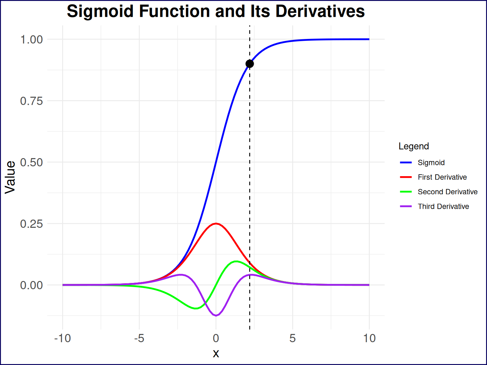

# Projects & Software

Where my bigger projects, software, and other things live–more condensed than the blog posts, although many of these projects have associated blog posts.

##### Have I Studied Enough to Pass?

I had to take a test. I was tired of studying during vacation so I did what any reasonable person would do: I made a Monte Carlo simulation to see if I could stop studying.

##### Master’s Thesis: Interrater Reliability of Cancer Tumor Response

This links directly out to my master’s thesis, which I completed in 2025. I did a deep dive into interrater reliability of the Response Evaluation Criteria in Solid Tumors…

##### {ordinalsimr}: My First R Package on CRAN

This is my first R package, which I developed and released on CRAN in 2025. It provides a Shiny application for simulating ordinal data, and running a variety of statistical…
